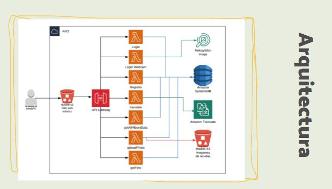
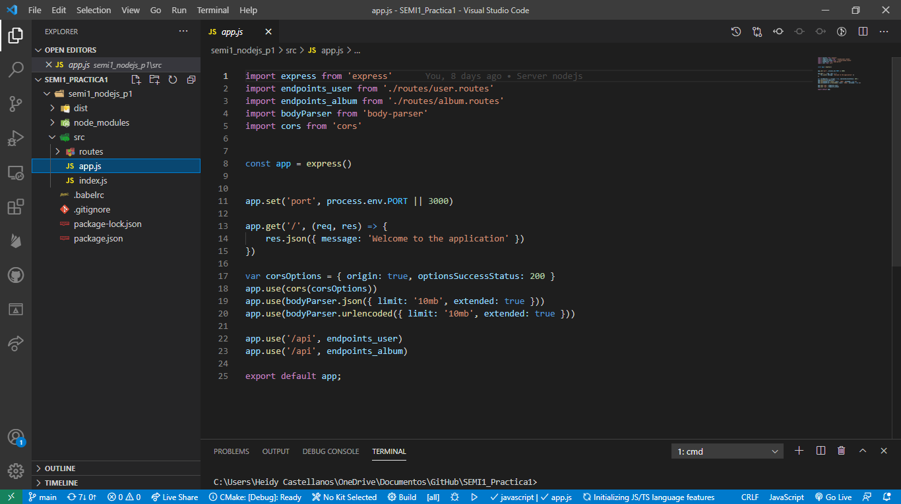
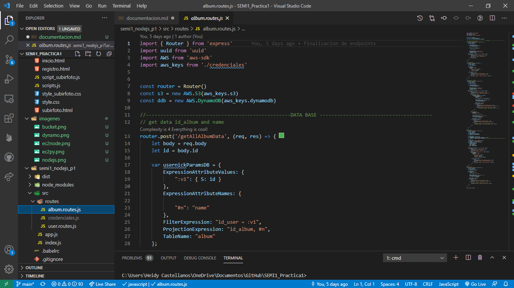
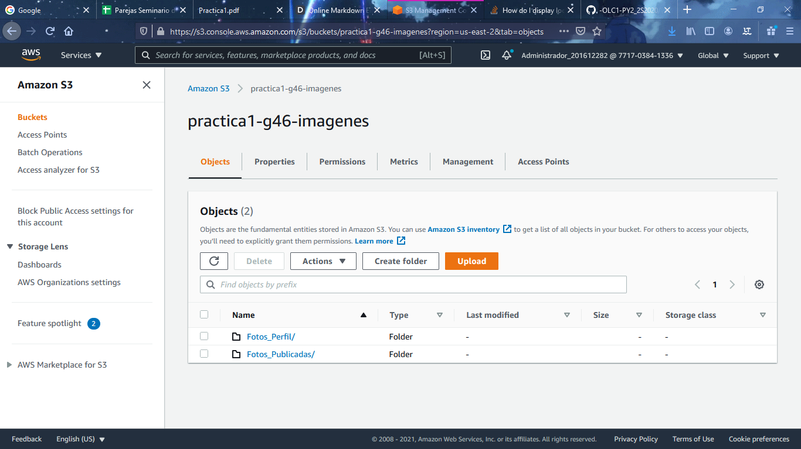
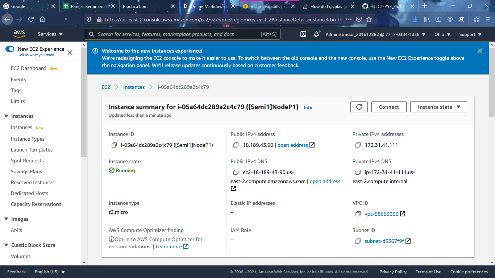
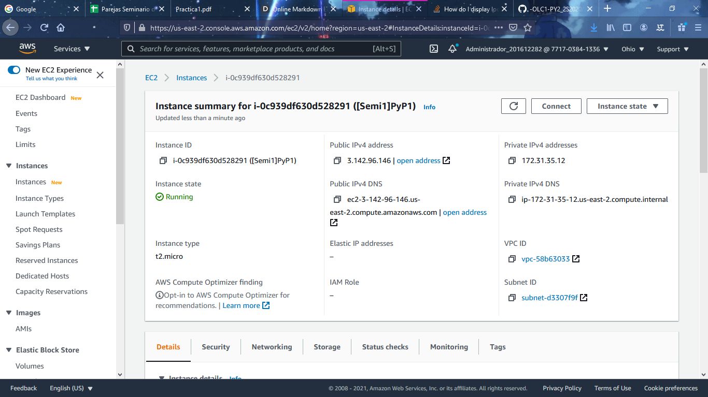
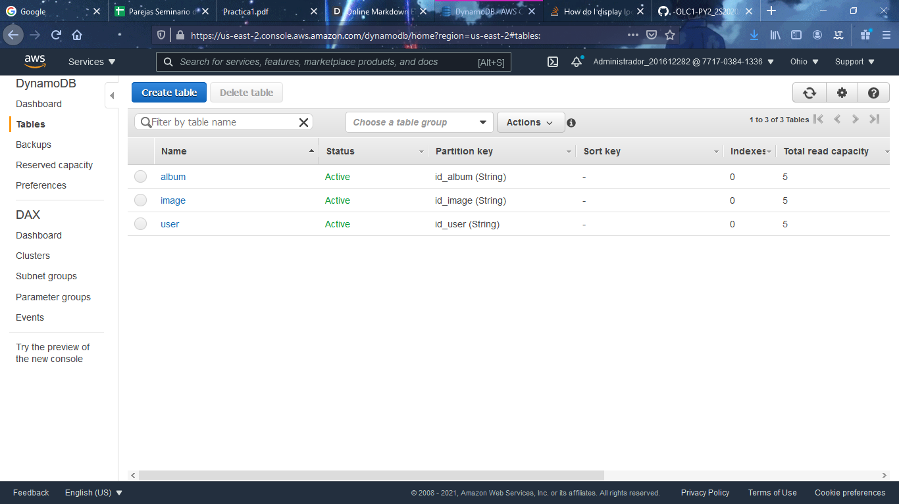
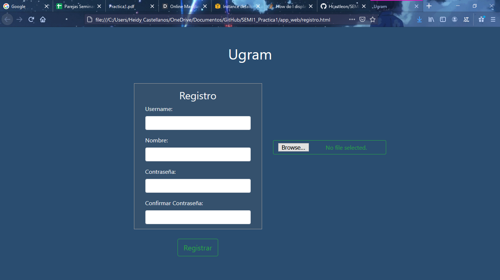
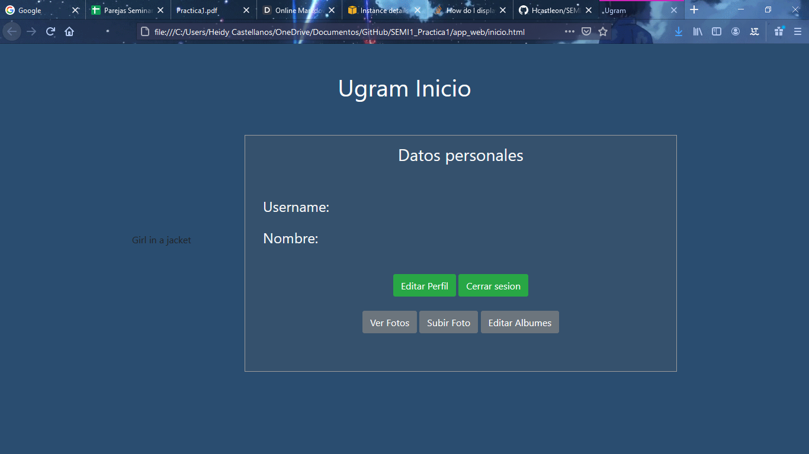

# Seminario de Sistemas 1
## _PROYECTO_

### TPC

Es aplicación web que almacena fotos de platillos junto con sus recetas. Esta permite subir todo tipo de fotos. Tiene como funcionalidad las secciones para listar todas las fotos subidas, listarlas por álbumes o mostrar las fotos de perfil del usuario, todo esto para cada usuario y crear de forma interactiva tu recetario personal que podras compartir con otros usuarios.

#### Datos Estudiantes
| Nombre | Carné |
| ------ | ------ |
| Heidy Carolina Castellanos de León | 201612282 |
| Josué Carlos Pérez Montenegro  | 201403546 |
#### Arquitectura

##### _Base de datos_
La base de datos esta diseñada por tres tablas:
> User--> id_user: identificador del usuario
        nick: registro con el que se esta manejando la cuenta
        name: nombre del usuario
        password: contraseña de la cuenta
        photo: La foto de perfil asociada a la cuenta
        
> Album--> id_album: identificador del album
        id_user: identificador del usuario (para asociar un album a un usuario)
        name: nombre del album
        
> Image--> id_image: identificador de una imagen
         id_album: identificador del album (para asociar una imagen a un album)
         name: nombre de la foto
         photo: direccion de la imagen 
         
##### _Servidor Nodejs_
- [Dependecia] - aws-sdk: 2.853.0
- [Dependecia] - cors: 2.8.5
- [Dependecia] - express: 4.17.1
- [Dependecia] - md5: 2.3.0
- [Dependecia] - mysql: 2.18.1

#### Usuarios de IAM
- bucket_user
     - AmazonS3FullAccess 
- dynamoDB_user 
    - AmazonDynamoDBFullAccess 
- rekognition_user
    -  AmazonRekognitionFullAccess 
- translate_user
   -  TranslateFullAccess 
- lex_user
  -  AmazonLexFullAccess 

#### Capturas de Pantalla
##### _Buckets de S3_

##### _EC2_

##### _DynamoDB_

##### _Lex_

##### _Aplicación Web_

